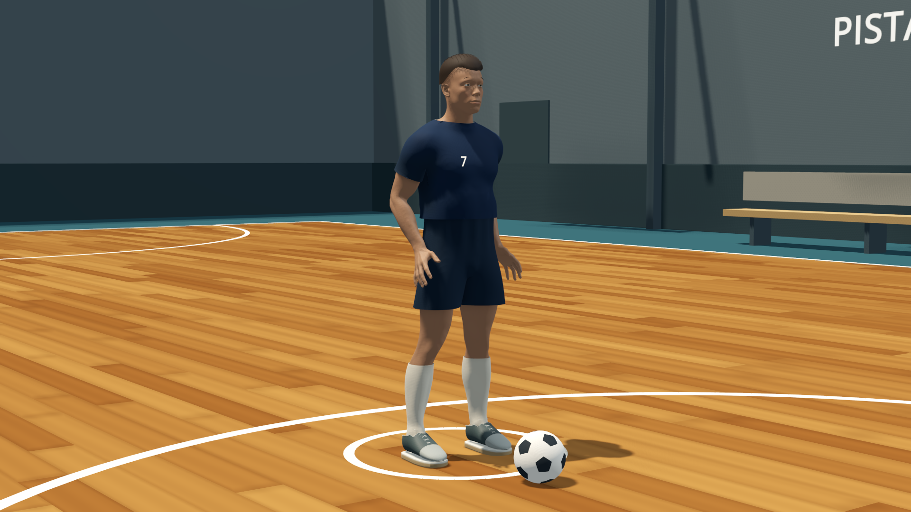
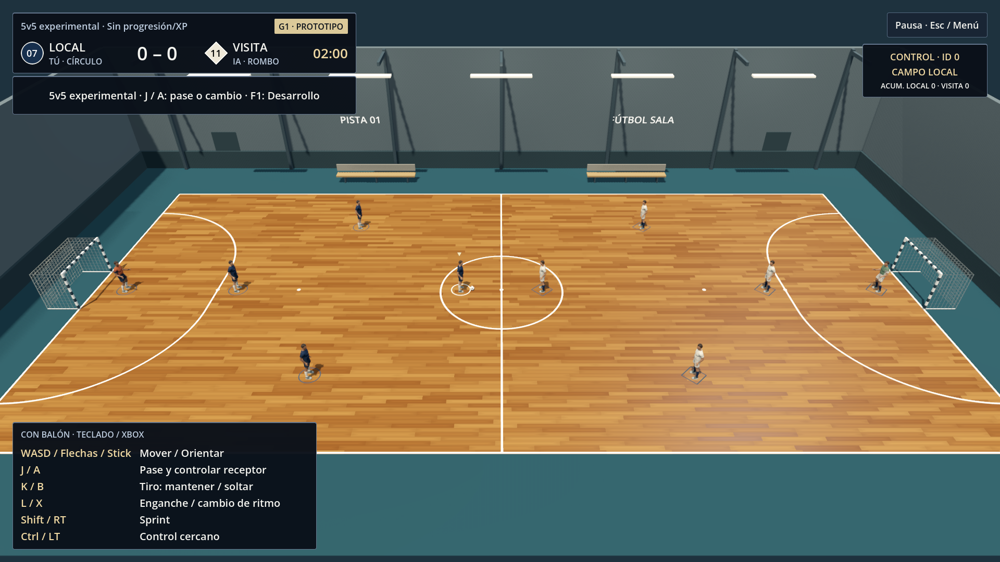

# Futsal

Fútbol sala **3D, single player primero**, con cancha cuidada y control excelente.
Sensación, animación y lectura del balón son prioritarias. El laboratorio 5v5
autorizado sirve para evaluar escala, no adelanta la aceptación del producto.
El multijugador futuro será cliente-servidor autoritativo, fuera del MVP.

## Descargas

Repositorio público: [jmanuelcorral/futsal](https://github.com/jmanuelcorral/futsal).
Los paquetes de **Windows, macOS y Linux** se distribuyen en
[GitHub Releases](https://github.com/jmanuelcorral/futsal/releases), junto con
sus checksums e instrucciones. Son **previews experimentales**, no el MVP final.
La compilación reproducible y los límites de validación/firma de cada plataforma
se documentan en [Distribución](https://github.com/jmanuelcorral/futsal/blob/main/docs/DISTRIBUTION.md).
No necesitas Blender ni un editor de Godot para ejecutar los paquetes.
La fuente actual corresponde a **0.5.0-preview**, con los atletas articulados R3.
Las descargas históricas de **0.4** conservan la representación anterior.

## Atletas de la preview gráfica



Detalle con **cámara diagnóstica**, no la cámara habitual de juego, en la micro
de cuatro atletas. Malla humana continua, equipación y materiales PBR de la
adaptación R3; pelo, manos y acabados siguen pendientes.



Vista de retransmisión del **5v5 experimental, diez atletas**. Ambas imágenes son
capturas sin retocar del candidato local Windows **0.5.0-preview**, EXE
`165a31dfa21b09b6d056a8bb202e188827143477b53ca2ecad13fb4d22d45208`,
a 1920×1080 con Forward+. No son un benchmark ni una aprobación artística.

## Qué se está construyendo

- PC Windows, mando primero y cámara elevada de retransmisión; estilo arcade-sim.
- **12 jugadores por equipo:** 2 porteros y 10 de campo; 5 activos y 7 suplentes.
  Cambios ilimitados legales y presets que reutilizan jugadores, nunca 15 identidades.
- Escudo, colores y equipaciones local/visitante configurables.
- **100 XP iniciales compartidos por equipo**, sobre atributos base jugables.
  **+3 una sola vez por victoria de carrera completada**, para asignarlos libremente
  entre los atributos elegibles, respetando topes.
- Partido rápido con ambos equipos autogenerados y tres dificultades de IA.
  Su estado es efímero: no modifica carreras ni concede XP de carrera.

Son requisitos, **no funcionalidades ya implementadas**.

## Estado real — 16 de septiembre de 2026

| Área | Disponible / pendiente |
|---|---|
| Decisión de stack | Godot **4.7.2**, Forward+, GDScript tipado y Jolt a 60 Hz; elección revisable, no benchmark |
| Blender/MCP | Blender **4.5.13 LTS** instalado; corrección MCP Windows migrada, probada con concurrencia real y **aceptada formalmente por Vasquez**; evidencia en [TOOLING](https://github.com/jmanuelcorral/futsal/blob/main/docs/TOOLING.md) |
| dream-loop | Skill MIT vendorizada sin modificar; sin referencia A-G2/A-G3 comparable aprobada ni puntuación visual de producto |
| Godot y diagnóstico | **Verificado**: Godot 4.7.2 estándar, templates Windows y bootstrap debug exportado, con comprobación independiente de coordinación. No es un juego |
| Base G1 histórica | Micro 1v1 + dos porteros, controles, cámara y HUD, validada el 9/9. Representación provisional; sin audio. Contrato en [MICRO_SLICE](https://github.com/jmanuelcorral/futsal/blob/main/docs/MICRO_SLICE.md) |
| Build G1 preservada | `build\windows\FutsalG1-20260909.exe`: copia histórica conservada por coordinación para comparar antes/después; no es la preview |
| Preview 0.2.0 histórica | Diez cuerpos/nueve IA, micro, Desarrollo y mejoras provisionales de parqué, iluminación/sombras y sprint, aprobados técnicamente. Coordinación conserva la build byte a byte en `build\windows\FutsalPreview-0.2.0.exe` |
| Preview 0.3.0 histórica | **0.3.0-preview / input schema 2**: cambio de jugador y pase con transferencia de foco, incluido portero manual. Fuente, ejecutable y GPU verificados; contrato en [DEVELOPMENT_PLAN §4.2](https://github.com/jmanuelcorral/futsal/blob/main/docs/DEVELOPMENT_PLAN.md) |
| Build 0.3.0 preservada | `build\windows\FutsalPreview-0.3.0.exe`, copia byte-idéntica de **103387808 bytes**, con identidad y evidencia en [TOOLING](https://github.com/jmanuelcorral/futsal/blob/main/docs/TOOLING.md) |
| Salida local 0.4 preservada | `build\windows\FutsalG1.exe`: **0.4.0-preview / input schema 3**. Copia fija `build\windows\FutsalPreview-0.4.0.exe`; no se sustituye al preparar la preview gráfica |
| Revisión técnica 0.4 histórica | **Cerrada por Vasquez**: fuentes aprobadas y aprobación estructural del paquete 0.4. Pipeline integral **196/196**, con bandas/córners/meta, regates, faltas y regresiones de pase/foco. No aceptación humana, artística o de FPS |
| Jugabilidad 0.4 | IA aliada pasadora, bandas/córners/meta, regates, faltas/libres/penaltis/acumuladas, cámara de córner y guía de apuntado implementados en ambos modos según el [plan §4.3](https://github.com/jmanuelcorral/futsal/blob/main/docs/DEVELOPMENT_PLAN.md). No es el MVP completo |
| Fuente gráfica 0.5 | Atleta humano con skinning, rig de 54 huesos, materiales PBR, ajustes de sprint/contactos, TAA y sombras filtradas. Base anatómica Blender Studio CC0 adaptada; no se copian activos de otros juegos. Conserva la jugabilidad y el input schema 3 |
| Gates de producto | Tras tres rondas de atletas siguen pendientes pelo, manos y acabados, referencia A-G2/A-G3, puntuación visual, rendimiento y aceptación humana |

Una conexión MCP o un ejecutable diagnóstico **no acreditan gameplay ni arte**.
El objetivo es 1080p60 medido; no se ha verificado ni se deduce del hardware.
Las rutas `build\...` y `tools\...\runtime\...` de este historial corresponden al
entorno local de desarrollo, no a archivos incluidos en un clon público. Las
releases publicadas tienen sus propios paquetes, hashes y resultados de CI.

## Inicio rápido

Para jugar, descarga y extrae el paquete de tu sistema desde GitHub Releases.
En Windows abre `Futsal.exe`; en Linux conserva `Futsal.pck` junto a
`Futsal.x86_64`; en macOS abre `Futsal.app`. Consulta sus avisos de firma
y el modo debug explícito de Linux en Distribución.

Las rutas `build\windows\...` son entregas del entorno local, no ejecutables
incluidos en el clon. Las copias G1/0.2/0.3/0.4 y la R3 local se conservan para
comparar; sus resultados no se atribuyen automáticamente a una nueva release.
Para desarrollar:

1. Lee [Herramientas locales](https://github.com/jmanuelcorral/futsal/blob/main/docs/TOOLING.md): requisitos, versiones, instalación,
   lanzadores y pruebas. No instalar otros motores.
2. Para Blender/MCP, sigue allí **«Utilizar en la próxima sesión»** y **«Verificar»**.
   Procesos locales bajo demanda; la aceptación técnica de MCP no acredita el juego.
3. Recupera los assets versionados con Git LFS antes de importar:

   ```powershell
   git lfs pull
   ```

   Abre `game\project.godot` o ejecuta el main del laboratorio desde la raíz:

   ```powershell
   pwsh -NoProfile -File .\tools\godot\Start-Godot.ps1 -RunGame
   ```

   El bootstrap sigue siendo un diagnóstico separado, no la escena principal.
   Fuente y guardas requieren 0.5/schema 3; una configuración anterior no
   sustituye su validación. El cierre integral del ejecutable se registra en TOOLING.
   `Test-Godot.ps1` exporta únicamente un diagnóstico aislado. `Test-MicroSlice.ps1`
   valida primero un candidato aislado y solo después lo promueve a la ruta
   compatible, conservando los bytes anteriores; no sustituye la build al empezar.
4. Trabaja solo en paquetes autorizados con revisor. Fuentes de autoría: `art\source\`;
   `.glb` runtime: `game\assets\`.

## Modos y controles del laboratorio

La preview gráfica **0.5** conserva la jugabilidad **0.4** y el pase/cambio de 0.3:

- **5v5 experimental**, predeterminado: diez cuerpos físicos, seleccionado inicial
  `0`, cuatro jugadores de campo por equipo y dos porteros. Puede controlarse
  cualquier HOME, incluido el portero `2`; nunca dos humanos a la vez.
- **1v1 de regresión**: cuatro cuerpos, humano contra un rival y dos porteros.
  El core conserva este modo al recibir `start/reset(null)`; el host elige
  explícitamente `MatchSetup.preview_5v5()` para su arranque normal. En micro se
  alterna entre el campo `0` y el portero local `2`.
- **F1** o **Pausa → Desarrollo**: cambiar modo empieza otra sesión con IA
  predeterminada. Desarrollo configura **intención**, incluido el seleccionado:
  rivales, campo local (`[0]` en micro; `[0,4,6,8]` en 5v5) y portero local `[2]`.
  La IA efectiva excluye al controlado. Defaults de intención `[0..3]` / `[0..9]`,
  con tres/nueve IA efectivas al seleccionar `0`; `[]` apaga todo. Deseleccionar
  a alguien no reactiva una preferencia apagada. Cambiar IA no reinicia el reloj
  ni elimina cuerpos. Reiniciar conserva modo e intención; aplicar otro modo
  restaura sus defaults. El saque de centro vuelve a `0`; una reanudación local
  da el foco a su sacador, incluido el portero en meta.
- **Ejercicios en Desarrollo**: juego libre, banda, cuatro córners, meta, enganche,
  cambio de ritmo, libre directo, penalti y sexta acumulada. Elegir en el
  desplegable no cambia el juego: pulsa **Aplicar ejercicio**. Reinicia la
  situación conservando modo, intención de IA y preferencia de guía.
- **Guía de apuntado**: se puede activar/desactivar desde Desarrollo. Aparece al
  cargar el tiro o preparar una reanudación propia; no revela la intención rival.
- Esc/B/Start desde Desarrollo vuelve a pausa/resultado; **no reanuda** el juego.
  El recorrido automático usa eventos nativos de teclado, mando y ratón;
  no sustituye una prueba humana con mando físico.

| Acción | Teclado | Mando Xbox |
|---|---|---|
| Moverse / elegir dirección / apuntar un saque propio | WASD o flechas | Stick izquierdo |
| Sprint / control cercano y contención | Shift / Ctrl | RT / LT |
| Con balón: pase; sin balón: cambiar compañero | J | A |
| Cargar y soltar tiro / robo sin balón | K | B |
| Regate; elegir punto legal si el saque ofrece alternativa | L + dirección | X + dirección |
| Ajuste fino en reanudación propia | Ctrl + A/D o ←/→ | LT + stick izquierdo horizontal |
| Pausa y menú de reinicio | Esc | Start |
| Desarrollo | F1; o botón Desarrollo, foco + Intro | Desde pausa/resultado, botón Desarrollo, foco + A |

Sin balón, J/A elige al compañero más cercano **al controlado**, con desempate por
ID; con dirección usa un cono de 35°. El portero es elegible y no hay un radio
máximo arbitrario. Con balón, el foco pasa al receptor efectivo **en la patada
aceptada, antes de recibir**: no al encolar el comando, ni en un pase fallido/libre,
ni por una intercepción. El portero controlado pasa manualmente; fuera de foco
recupera su IA/devolución solo si su intención sigue activada.

Mantener J/A o su repetición no encadena acciones: liberar antes de otra pulsación.
Movimiento y sprint continúan al cambiar foco; carga y botones retenidos no se
trasladan al nuevo actor. Pausa, foco de ventana y desconexión conservan su barrera
de neutral; pausa/pausa de gol/fin conservan selección durante la fase. Tras
pausa/reinicio hay que soltar los controles para evitar acciones retenidas.
Son sesiones de 120 s efectivos con reposiciones de
entrenamiento y reanudaciones locales, no partidos reglamentarios completos.
No se guardan resultados ni se concede XP.

**La IA local recupera, apoya y pasa, pero no finaliza intencionadamente.**
El jugador controlado y el rival pueden rematar; un desvío físico accidental de
un compañero no se borra. El regate lateral produce un enganche y el frontal/neutro
un cambio de ritmo, con toque real, recuperación y balón disputable.

Bandas, córners y saques de meta respetan beneficiario, ubicación y último toque;
la preparación propia cambia el input a apuntado. **J/A en meta lanza con manos**.
La cámara de córner se coloca detrás del sacador local y vuelve al seguimiento
al golpear. La flecha refleja dirección y potencia del mismo cálculo de lanzamiento,
no promete una recepción ni dibuja una trayectoria simulada aparte. El ajuste fino
gira hasta **30°/s**, sin mover al sacador ni ampliar el plazo.

Faltas por contacto, libres, penaltis a 6 m y acumuladas están implementados con
las simplificaciones declaradas. El HUD muestra beneficiario, faltas, instrucciones
y cuenta de cuatro segundos cuando corresponda; el penalti no usa esa cuenta.
No hay tarjetas, ventaja, sustituciones, dos tiempos ni reglamento completo.


Captura original del ejecutable **0.4.0, 5v5 experimental**, 1920×1080,
sin retoques. Las veinte capturas verificadas del EXE, de ambos modos, están en
`build\evidence\0.4.0-preview\gameplay` en el entorno local, con su manifiesto
y checksums; la imagen de arriba es una copia byte-idéntica para el repositorio.
Se preservan la [captura 0.3.0](https://github.com/jmanuelcorral/futsal/blob/main/docs/images/player-control-5v5.png), la
[captura 0.2.0](https://github.com/jmanuelcorral/futsal/blob/main/docs/images/preview-5v5.png) y la
[captura G1](https://github.com/jmanuelcorral/futsal/blob/main/docs/images/g1-prototype.png), de cuatro atletas.
**Representación provisional, no acabado final ni
referencia aprobada para G2/G3.** El A/B continuo del parqué **0.2.0** y sus límites están
en [ART_DIRECTION](https://github.com/jmanuelcorral/futsal/blob/main/docs/ART_DIRECTION.md); una imagen fija no prueba estabilidad
en movimiento ni FPS.

## Documentación y siguiente gate

| Documento | Fuente de verdad |
|---|---|
| [MVP](https://github.com/jmanuelcorral/futsal/blob/main/docs/MVP.md) | Producto, controles, plantilla, XP y aceptación |
| [Plan de desarrollo](https://github.com/jmanuelcorral/futsal/blob/main/docs/DEVELOPMENT_PLAN.md) | G0–G5, dependencias, propietarios y pruebas |
| [Stack](https://github.com/jmanuelcorral/futsal/blob/main/docs/STACK_DECISION.md) | Comparativa, decisión y arquitectura propuesta |
| [Arte](https://github.com/jmanuelcorral/futsal/blob/main/docs/ART_DIRECTION.md) | Referencias por fase, pipeline y criterios visuales |
| [Referencias FIFA](https://github.com/jmanuelcorral/futsal/blob/main/docs/VISUAL_REFERENCES.md) | Cámaras de Rush, Futsal de VOLTA y adaptación al pabellón, sin copiar activos |
| [Microdemo G1](https://github.com/jmanuelcorral/futsal/blob/main/docs/MICRO_SLICE.md) | Contratos implementados, geometría, simplificaciones y pruebas nativas |
| [Tooling](https://github.com/jmanuelcorral/futsal/blob/main/docs/TOOLING.md) | Instalaciones y evidencias operativas de Ferro |
| [Distribución](https://github.com/jmanuelcorral/futsal/blob/main/docs/DISTRIBUTION.md) | Builds públicas, releases, firma y comprobaciones por plataforma |

Orden: **G0 técnico → G1 micro 1v1 + dos porteros → G2 arte con cuatro atletas →
G3 5v5 con diez → G4 editor/modos/XP → G5 demo validada**.

G2 necesita una imagen con derechos aportada y aprobada por el usuario, **o** un
generador autorizado y posterior aprobación humana. Hoy no hay ninguna referencia
aprobada ni generador habilitado. G3 necesitará su referencia de diez atletas:
no comparar cuatro contra diez. Dream-loop exige crítico independiente, escalera
de cinco tiers y nota ≥ 8 **más** rendimiento; movimiento y mando se prueban aparte.
Máximo 3 rondas por gate, parada tras 2 sin mejora y presupuesto de API **0**.
El laboratorio experimental 5v5, Desarrollo, pase/foco, jugabilidad **0.4**
y atletas **0.5** son una prueba acotada, **no una aceptación G2/G3**. La implementación y las
pruebas técnicas tampoco conceden aceptación humana, artística o de rendimiento.
La build disponible no incorpora editor de equipos, progresión, XP, red,
dificultades ni juego completo o arte final aprobado. La publicación pública y
las releases fueron autorizadas el 15/9 y la publicación de los cambios gráficos
el 16/9; no autorizan servicios pagados ni nuevos sistemas de producto.

## Alcance público y licencias

Los historiales y configuraciones personales de asistentes, inventarios locales,
credenciales y evidencias temporales no se publican. Los documentos conservan
referencias al proceso local; no es necesario reproducir ese entorno de agentes
para abrir `game\project.godot` o compilar una release.

Esta publicación no asigna automáticamente una licencia de reutilización al
código o arte propios del juego. Las dependencias y el contenido de terceros
conservan sus licencias; los paquetes gráficos incluyen los avisos del motor
Godot, sus componentes y la base anatómica CC0 en `THIRD_PARTY_NOTICES.md`.
La skill dream-loop vendorizada mantiene su licencia MIT.
